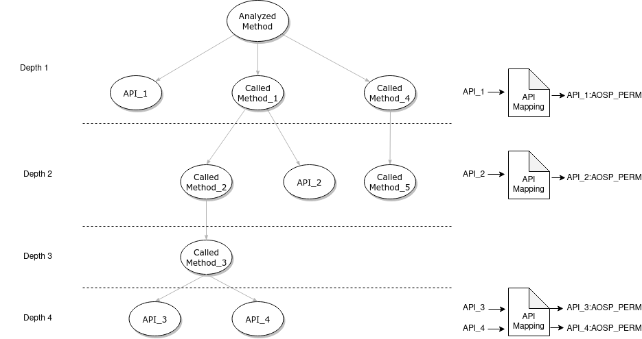

# PermissionTracer

PermissionTracer is a tool developed with purpose of understanding what kind of component is protected by a given custom permission. Two different analysis are applied in the given class, being one of these analysis dependent on the type of component.

## Extraction of AOSP permissions related to API calls

PermissionTracer makes a tree analysis of each method from a given class, so for each internal method of a class the tool pases the *Smali* code to look for uses of the *invoke* instruction, in a *Breadth-first search* the tool classifies the methods as external or internal, for the former, the tool looks for its prototype in the mappings of APIs-AOSP Permissions from androguard to extract the corresponding AOSP permissions, if any, and the latter (internal methods) are pushed into a stack for recursively applying a *Depth-first search* analysis once the tool has analyzed the current method.

The process is represented in the next picture, the APIs are sorted by the order they are discovered, and the called methods are sorted by the order of how they are analyzed, at the top the tree has the method analyzed from the given component. The image also present how the API calls are extracted and checked with the API mappings:



## Extraction of information from different components

For understanding what a custom permission is protecting, it is useful to analyze what different type of components expose to other applications, for that reason, PermissionTracer analyze the code from the components in order to extract useful information that exposes to other apps.

* For *Activities* and *broadcast receivers*:
    * Search the references to method *setResult* that would allow the component to return data to caller through an Intent.
    * For each reference in the analyzed component, extract the return type from the returned data and the key of the value.

* For *Services* as they return an interface of methods another app can call:
    * Search references to method *onBind* in the analyzed component.
    * Analyze the Smali code to get all the returned objects.
    * Each returned object has an interface, so the tool extracts the instantiated class from the object, and all the available methods are extracted.

* Finally as *Content Providers* works as database for other applications retrieve data, PermissionTracer applies the next simple analysis:
    * Search references to method *getType* from a Cursor object from the analyzed component.
    * Extract the MIME type.

## Example of Usage:

The application *SmartShare.apk* exposes a service protecting it with a permission named *com.lge.smartshare.iface.permission* with a protection level of **normal** allowing any application request it without user consent, if we analyze the application with PermissionTracer we can spot some interesting methods exposed by this service:

```console
./permissionsTracer.py -i test/SmartShare.apk --class_name com/lge/smartshare/iface/SmartShareManager
{
"Lcom/lge/smartshare/iface/SmartShareManager;": {
        "component_type": "Service",
                "data_provided": {},
                        "intent-filter_actions": [],
                        "interface": [
                        {
                        "<init>": {
                                            "parameters": [],
                                                                "return-type": "void"
                                                                                
                        }
                                    
                        },
                        {
                        "asInterface": {
                        "parameters": [
                                                "Landroid/os/IBinder;"
                                                                    
                        ],
                                            "return-type": "Lcom/lge/smartshare/iface/aidl/ISmartShareManager;"
                                                            
                        }
                                    
                        },
                        {
                        "asBinder": {
                                            "parameters": [],
                                                                "return-type": "Landroid/os/IBinder;"
                                                                                
                        }
                                    
                        },
                        {
                        "onTransact": {
                        "parameters": [
                                                "integer",
                                                                        "Landroid/os/Parcel;",
                                                                                                "Landroid/os/Parcel;",
                                                                                                                        "integer"
                                                                                                                                            
                        ],
                                            "return-type": "boolean"
                                                            
                        }
                                    
                        },
                        {
                        "attachInterface": {
                        "parameters": [
                                                "Landroid/os/IInterface;",
                                                                        "Ljava/lang/String;"
                                                                                            
                        ],
                                            "return-type": "void"
                                                            
                        }
                                    
                        },
                        {
                        "getManagerVersionCode": {
                                            "parameters": [],
                                                                "return-type": "integer"
                                                                                
                        }
                                    
                        },
                        {
                        "register": {
                        "parameters": [
                                                "Ljava/lang/String;",
                                                                        "Lcom/lge/smartshare/iface/aidl/ISmartShareManagerCallback;"
                                                                                            
                        ],
                                            "return-type": "void"
                                                            
                        }
                                    
                        },
                        {
                        "unregister": {
                        "parameters": [
                                                "Ljava/lang/String;"
                                                                    
                        ],
                                            "return-type": "void"
                                                            
                        }
                                    
                        },
                        {
                        "getPlayerId": {
                        "parameters": [
                                                "Ljava/lang/String;"
                                                                    
                        ],
                                            "return-type": "integer"
                                                            
                        }
                                    
                        },
                        {
                        "getRenderers": {
                                            "parameters": [],
                                                                "return-type": "Lcom/lge/smartshare/iface/aidl/DataRenderer;[]"
                                                                                
                        }
                                    
                        },
                        {
                        "getRendererIcon": {
                        "parameters": [
                                                "Ljava/lang/String;"
                                                                    
                        ],
                                            "return-type": "Landroid/graphics/Bitmap;"
                                                            
                        }
                                    
                        },
                        {
                        "getRendererUsageInfo": {
                                            "parameters": [],
                                                                "return-type": "Lcom/lge/smartshare/iface/aidl/DataRendererUsageInfo;[]"
                                                                                
                        }
                                    
                        },
                        {
                        "refreshRenderer": {
                        "parameters": [
                                                "boolean"
                                                                    
                        ],
                                            "return-type": "integer"
                                                            
                        }
                                    
                        },
                        {
                        "checkSupportContent": {
                        "parameters": [
                                                "Ljava/lang/String;",
                                                                        "Ljava/lang/String;"
                                                                                            
                        ],
                                            "return-type": "integer"
                                                            
                        }
                                    
                        },
                        {
                        "startRenderer": {
                        "parameters": [
                                                "integer",
                                                                        "Ljava/lang/String;",
                                                                                                "Lcom/lge/smartshare/iface/aidl/DataContentInfo;",
                                                                                                                        "integer"
                                                                                                                                            
                        ],
                                            "return-type": "integer"
                                                            
                        }
                                    
                        },
                        {
                        "stopRenderer": {
                        "parameters": [
                                                "integer"
                                                                    
                        ],
                                            "return-type": "integer"
                                                            
                        }
                                    
                        },
                        {
                        "play": {
                        "parameters": [
                                                "integer",
                                                                        "Lcom/lge/smartshare/iface/aidl/DataContentInfo;",
                                                                                                "integer"
                                                                                                                    
                        ],
                                            "return-type": "integer"
                                                            
                        }
                                    
                        },
                        {
                        "stop": {
                        "parameters": [
                                                "integer"
                                                                    
                        ],
                                            "return-type": "integer"
                                                            
                        }
                                    
                        },
                        {
                        "pause": {
                        "parameters": [
                                                "integer"
                                                                    
                        ],
                                            "return-type": "integer"
                                                            
                        }
                                    
                        },
                        {
                        "resume": {
                        "parameters": [
                                                "integer"
                                                                    
                        ],
                                            "return-type": "integer"
                                                            
                        }
                                    
                        },
                        {
                        "seek": {
                        "parameters": [
                                                "integer",
                                                                        "integer"
                                                                                            
                        ],
                                            "return-type": "integer"
                                                            
                        }
                                    
                        },
                        {
                        "setVolume": {
                        "parameters": [
                                                "integer",
                                                                        "integer"
                                                                                            
                        ],
                                            "return-type": "integer"
                                                            
                        }
                                    
                        },
                        {
                        "getVolume": {
                        "parameters": [
                                                "integer"
                                                                    
                        ],
                                            "return-type": "integer"
                                                            
                        }
                                    
                        },
                        {
                        "getPlayerStatus": {
                        "parameters": [
                                                "integer"
                                                                    
                        ],
                                            "return-type": "Lcom/lge/smartshare/iface/aidl/DataPlayerStatus;"
                                                            
                        }
                                    
                        },
                        {
                        "getSelectedRenderer": {
                        "parameters": [
                                                "integer"
                                                                    
                        ],
                                            "return-type": "Lcom/lge/smartshare/iface/aidl/DataRenderer;"
                                                            
                        }
                                    
                        },
                        {
                        "selectRenderer": {
                        "parameters": [
                                                "integer",
                                                                        "Ljava/lang/String;"
                                                                                            
                        ],
                                            "return-type": "integer"
                                                            
                        }
                                    
                        },
                        {
                        "getPushMode": {
                                            "parameters": [],
                                                                "return-type": "integer"
                                                                                
                        }
                                    
                        },
                        {
                        "refreshServer": {
                        "parameters": [
                                                "boolean"
                                                                    
                        ],
                                            "return-type": "integer"
                                                            
                        }
                                    
                        },
                        {
                        "isConnectedWifiInterface": {
                                            "parameters": [],
                                                                "return-type": "boolean"
                                                                                
                        }
                                    
                        },
                        {
                        "isConnectedWifiDirectInterface": {
                                            "parameters": [],
                                                                "return-type": "boolean"
                                                                                
                        }
                                    
                        },
                        {
                        "getWFDDevices": {
                                            "parameters": [],
                                                                "return-type": "Lcom/lge/smartshare/iface/aidl/DataWFDDevice;[]"
                                                                                
                        }
                                    
                        },
                        {
                        "refreshWFDDevice": {
                        "parameters": [
                                                "boolean"
                                                                    
                        ],
                                            "return-type": "integer"
                                                            
                        }
                                    
                        },
                        {
                        "initWFD": {
                        "parameters": [
                                                "integer",
                                                                        "Ljava/lang/String;",
                                                                                                "Ljava/lang/String;",
                                                                                                                        "Ljava/lang/String;"
                                                                                                                                            
                        ],
                                            "return-type": "integer"
                                                            
                        }
                                    
                        },
                        {
                        "isAllServersCollected": {
                                            "parameters": [],
                                                                "return-type": "boolean"
                                                                                
                        }
                                    
                        },
                        {
                        "isServerCollected": {
                        "parameters": [
                                                "long"
                                                                    
                        ],
                                            "return-type": "boolean"
                                                            
                        }
                                    
                        },
                        {
                        "getDeviceNetworkType": {
                        "parameters": [
                                                "Ljava/lang/String;"
                                                                    
                        ],
                                            "return-type": "integer"
                                                            
                        }
                                    
                        },
                        {
                        "getDeviceIpAddress": {
                        "parameters": [
                                                "Ljava/lang/String;"
                                                                    
                        ],
                                            "return-type": "Ljava/lang/String;"
                                                            
                        }
                                    
                        },
                        {
                        "unregisterWithCallback": {
                        "parameters": [
                                                "Ljava/lang/String;",
                                                                        "Lcom/lge/smartshare/iface/aidl/ISmartShareManagerCallback;"
                                                                                            
                        ],
                                            "return-type": "void"
                                                            
                        }
                                    
                        },
                        {
                        "isAllHomecloudServersCollected": {
                                            "parameters": [],
                                                                "return-type": "boolean"
                                                                                
                        }
                                    
                        },
                        {
                        "isHomecloudServerCollected": {
                        "parameters": [
                                                "long"
                                                                    
                        ],
                                            "return-type": "boolean"
                                                            
                        }
                                    
                        },
                        {
                        "isHomecloudLogin": {
                                            "parameters": [],
                                                                "return-type": "boolean"
                                                                                
                        }
                                    
                        },
                        {
                        "getHomecloudRAServerCnt": {
                                            "parameters": [],
                                                                "return-type": "integer"
                                                                                
                        }
                                    
                        },
                        {
                        "isConnectedMobileInterface": {
                                            "parameters": [],
                                                                "return-type": "boolean"
                                                                                
                        }
                                    
                        },
                        {
                        "getDeviceMacAddress": {
                        "parameters": [
                                                "Ljava/lang/String;"
                                                                    
                        ],
                                            "return-type": "Ljava/lang/String;"
                                                            
                        }
                                    
                        },
                        {
                        "setMute": {
                        "parameters": [
                                                "integer",
                                                                        "boolean"
                                                                                            
                        ],
                                            "return-type": "integer"
                                                            
                        }
                                    
                        },
                        {
                        "getMute": {
                        "parameters": [
                                                "integer"
                                                                    
                        ],
                                            "return-type": "integer"
                                                            
                        }
                                    
                        },
                        {
                        "startRendererWithSubtitle": {
                        "parameters": [
                                                "integer",
                                                                        "Ljava/lang/String;",
                                                                                                "Lcom/lge/smartshare/iface/aidl/DataContentInfo;",
                                                                                                                        "integer",
                                                                                                                                                "Ljava/lang/String;"
                                                                                                                                                                    
                        ],
                                            "return-type": "integer"
                                                            
                        }
                                    
                        },
                        {
                        "playWithSubtitle": {
                        "parameters": [
                                                "integer",
                                                                        "Lcom/lge/smartshare/iface/aidl/DataContentInfo;",
                                                                                                "integer",
                                                                                                                        "Ljava/lang/String;"
                                                                                                                                            
                        ],
                                            "return-type": "integer"
                                                            
                        }
                                    
                        }
                                
                        ],
                                "protected_apis": {}
                                    
}

}
```
